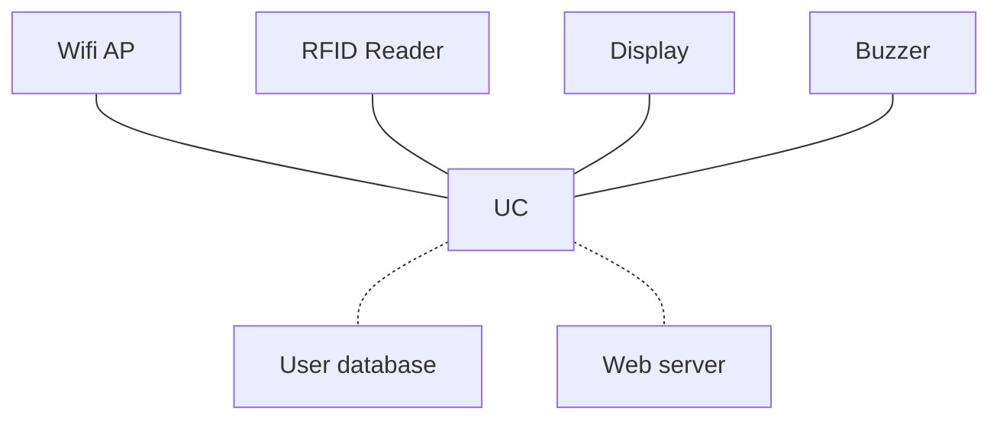

Coffee-Account-Badge
==========================
Specification
---

## System diagram

## User database
- Name (String)
- RFID UID (10 byte)
- Coffee counter (UInt)
- Balance (Int)
- Blocked (Bool)

## Web server
The web interface has two pages :
- User administration: Creation or deletion of user, balance and reset of the counter.
- Display of user data: Table with the balance and the counter of each user.

## Wifi AP
The system generates a soft Wifi Access Point.  
To access the web interface, it's necessary to connect to the access point and access the IP address http://192.168.1.1:80 or mDNS address "coffee.local".

## RFID Reader
The RFID reader permanently scans the presence of badges.  
A delay of 5 seconds between each reading is added to avoid unwanted badging. 
At each badge the UID is read to increment the counter of the corresponding user.

## Display
In standby, several information pages are displayed alternately in a loop:
- Prompt message: "Please badge before making a coffee"
- Connection information: AP name and interface IP.

During a correct badge the system displays for 10 seconds the name of the user and the counter. 
If the UID does not correspond to a registered user, the display indicates: "User not registered". 
If the badge reading failed the display shows "RFID error, please try again".

## Buzzer
When badged correctly, the buzzer beeps briefly. 
If the badge is incorrect (RFID error, wrong user) the buzzer sounds 3 long beeps.
